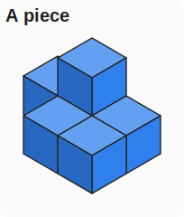
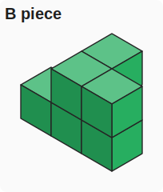
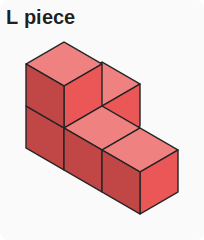
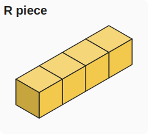
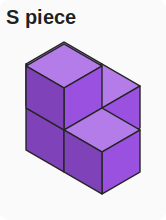
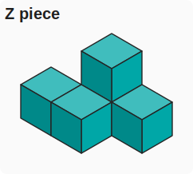

# Evil Cube Solver

This repository contains a small Python solver and counter for the regular
Printables Evil Cube puzzle:

https://www.printables.com/model/1339793-evil-cube

The regular Evil Cube is modelled as a 4x4x4 exact-cover polycube puzzle with
this inventory:

```text
Z S S S S R L A A B B B
```

That is one `Z`, four identical `S` bricks, one `R`, one `L`, two identical
`A` bricks, and three identical `B` bricks. The total volume is 64 unit cubes,
so a complete solution exactly fills a 4x4x4 cube.

## What Is Included

The useful project files are:

- `solve_evil_cube.py` - finds and prints a valid Evil Cube solution.
- `solve_ultra_cube.py` - finds and prints a valid Ultra Cube solution.
- `count_evil_cube_dlx.py` - fast labelled exact-cover counter using Algorithm X.
- `count_evil_cube_solutions.py` - raw physical-solution counter that collapses
  identical pieces during search.
- `count_ultra_cube_dlx.py` - fast labelled exact-cover counter for Ultra Cube.
- `count_ultra_cube_solutions.py` - raw physical-solution counter for Ultra Cube.
- `render_piece_svgs.py` - regenerates the isometric piece-identification
  images from the embedded shape data.
- `assets/pieces/*.svg` - isometric images of the six brick types.
- `evil_cube_solution.txt` - one valid layer-by-layer solution.
- `ultra_cube_solution.txt` - one valid layer-by-layer Ultra Cube solution.
- `REPORT.md` - notes from the exploratory counting runs.

The original downloaded 3D model ZIP/PDF and web cache files are not included
in this repository. They belong to the Printables model page and can be
downloaded there. The code stores only the derived unit-cube brick definitions
needed to solve the puzzle.

## Python Setup

Use Python 3.10 or newer. The scripts were verified with Python 3.10.6. Python
3.10 matters because the code uses modern type-hint syntax such as
`str | None`.

There are no third-party dependencies. You do not need `pip install` for the
solver, counters, or SVG renderer.

### Windows / PowerShell

Check whether Python is already available:

```powershell
py --version
python --version
```

Either command is fine. If one reports Python 3.10 or newer, use that command
for the rest of the README. On many Windows installs, `py` is the most reliable
launcher.

If Python is missing or too old:

1. Install Python 3.10 or newer from https://www.python.org/downloads/.
2. During install, enable "Add python.exe to PATH".
3. Open a new PowerShell window.
4. Run `py --version` or `python --version` again.

An optional virtual environment keeps the project isolated:

```powershell
py -3.10 -m venv .venv
.\.venv\Scripts\Activate.ps1
python --version
```

If PowerShell blocks activation, you can skip activation and call the venv
Python directly:

```powershell
.\.venv\Scripts\python.exe .\solve_evil_cube.py
```

### macOS / Linux

Check the version:

```bash
python3 --version
```

If it is Python 3.10 or newer, run scripts with `python3`:

```bash
python3 solve_evil_cube.py
```

Optional virtual environment:

```bash
python3 -m venv .venv
source .venv/bin/activate
python --version
```

## Quick Start

The examples below use `python`. If your setup uses the Windows launcher, replace
`python` with `py`. On macOS/Linux, use `python3` if `python` is not available.

Find one solution:

```powershell
python .\solve_evil_cube.py
```

Solve the Ultra Cube variant:

```powershell
python .\solve_ultra_cube.py
```

The general solver can also run named presets:

```powershell
python .\solve_evil_cube.py --puzzle evil
python .\solve_evil_cube.py --puzzle friendly
python .\solve_evil_cube.py --puzzle ultra
```

Or a custom inventory string:

```powershell
python .\solve_evil_cube.py --inventory ZRLLLLLLLLLLL
```

Print the embedded shape definitions:

```powershell
python .\solve_evil_cube.py --show-shapes
```

Run the faster labelled counter with progress reporting:

```powershell
python .\count_evil_cube_dlx.py --progress-every 1000 --heartbeat-seconds 60
```

Run the slower raw counter:

```powershell
python .\count_evil_cube_solutions.py --progress-every 1 --heartbeat-seconds 60
```

Count the Ultra Cube variant:

```powershell
python .\count_ultra_cube_dlx.py --progress-every 1000 --heartbeat-seconds 60
python .\count_ultra_cube_solutions.py --progress-every 1 --heartbeat-seconds 60
```

Both counters write progress to stdout and also append to a progress file by
default. That matters because complete counts can run for a long time; if a
process is stopped or times out, the last partial result remains available in
the progress file.

## The Found Solution

The solution in `evil_cube_solution.txt` is printed as layers `z=0` through
`z=3`. For physical assembly, read the layers top to bottom: `z=0` is the top
layer and `z=3` is the bottom layer. Rows are front to back; columns are left to
right.

```text
z=0
S4 B3 B3 B1
S4 B3 B2 B2
L1 S3 B2 B2
L1 L1 B2 R1

z=1
B3 B3 B3 B1
S4 S4 B1 B1
S4 S3 S3 B2
L1 S3 S2 R1

z=2
A2 A2 A2 B1
A1 A2 S1 B1
A1 S2 S3 Z1
L1 S2 S2 R1

z=3
A2 A2 S1 S1
A1 S1 S1 Z1
A1 A1 Z1 Z1
A1 S2 Z1 R1
```

Piece labels identify a specific copy of a brick type. For example, `S1` to
`S4` are the four `S` bricks, and `B1` to `B3` are the three `B` bricks.

## Ultra Cube

The Ultra Cube variant is described on the Printables model page as one `Z`
brick, one `R` brick, and eleven `L` bricks:

```text
Z R L L L L L L L L L L L
```

As an inventory string:

```text
ZRLLLLLLLLLLL
```

The dedicated command is:

```powershell
python .\solve_ultra_cube.py
```

The same result can be produced by the general solver:

```powershell
python .\solve_evil_cube.py --puzzle ultra
```

Ultra counting commands:

```powershell
python .\count_ultra_cube_dlx.py --progress-every 1000 --heartbeat-seconds 60
python .\count_ultra_cube_solutions.py --progress-every 1 --heartbeat-seconds 60
```

The raw Ultra counter completed quickly in a verification run:

```text
inventory=ZRLLLLLLLLLLL
raw_fixed_cube_solutions=24
unique_up_to_cube_rotation=1
cube_rotations=24
```

Interpretation: the Ultra Cube has one physical solution up to cube rotation.
The `24` raw fixed-cube solutions are the 24 rotations of that same assembly.
This matches the designer's note that Ultra appears to have only one solution.

One Ultra Cube solution is saved in `ultra_cube_solution.txt`:

```text
z=0
L7 L7 L11 L9
L7 Z1 L11 L11
L2 Z1 Z1 L10
L2 L2 Z1 R1

z=1
L7 L9 L9 L9
L5 L8 L11 L9
L1 L8 Z1 L10
L2 L8 L8 R1

z=2
L7 L6 L6 L4
L5 L6 L11 L10
L1 L6 L10 L10
L2 L8 L3 R1

z=3
L5 L6 L4 L4
L5 L5 L3 L4
L1 L1 L3 L4
L1 L3 L3 R1
```

Use the same physical reading convention as the Evil solution: `z=0` is the top
layer and `z=3` is the bottom layer.

## Brick Model

The solver represents each physical brick as a set of unit-cube coordinates.
The embedded shapes are:

```text
A: 6 cubes
B: 6 cubes
L: 5 cubes
R: 4 cubes
S: 5 cubes
Z: 5 cubes
```

### Piece Identification

These isometric SVGs are generated from the exact embedded coordinates in
`solve_evil_cube.py`. They are meant as a quick visual guide when matching the
printed solution labels to the physical pieces.

| Piece | Image | Volume | Count in Evil Cube | Count in Ultra Cube |
| --- | --- | ---: | ---: | ---: |
| `A` |  | 6 | 2 | 0 |
| `B` |  | 6 | 3 | 0 |
| `L` |  | 5 | 1 | 11 |
| `R` |  | 4 | 1 | 1 |
| `S` |  | 5 | 4 | 0 |
| `Z` |  | 5 | 1 | 1 |

Regenerate the images after changing any shape coordinates:

```powershell
python .\render_piece_svgs.py
```

The total inventory volume is:

```text
Z  = 1 * 5 = 5
S  = 4 * 5 = 20
R  = 1 * 4 = 4
L  = 1 * 5 = 5
A  = 2 * 6 = 12
B  = 3 * 6 = 18
total        64
```

The definitions in `solve_evil_cube.py` were derived from the author's public
Friendly Cube reference OBJs and then embedded so the solver can run without
large model files.

If you have those reference OBJs in a local `reference_bricks/` directory, you
can validate the embedded shapes:

```powershell
python .\solve_evil_cube.py --validate-reference
```

That validation step is optional and is not required to solve the regular Evil
Cube.

## How The Solver Works

The basic solver is an exact-cover search.

1. Build all piece instances from the inventory string `ZSSSSRLAABBB`.
2. Generate every orientation of each brick under cube rotations.
3. Translate each oriented brick through the 4x4x4 box.
4. At each search step, choose the empty cell with the fewest legal placements.
5. Place a compatible brick, recurse, and backtrack if the branch fails.

This is a common exact-cover approach for polycube puzzles. The "fewest legal
placements" heuristic is what makes the first solution appear quickly instead
of wandering through a huge search tree.

## Counting Solutions

There are two counters because "number of solutions" can mean different things.

### Labelled DLX Counter

`count_evil_cube_dlx.py` uses Algorithm X over exact-cover columns:

- 64 cube-cell columns
- 12 piece-instance columns

Internally, it treats the four `S` bricks, two `A` bricks, and three `B` bricks
as individually labelled objects. This is fast and simple for Algorithm X, but
it over-counts physical puzzle solutions.

The duplicate labelling factor is:

```text
4! * 2! * 3! = 288
```

So a fully completed labelled count can be converted to a fixed-cube physical
count by dividing by 288, assuming the labelled traversal has completed.

Important: a partial labelled count from an unfinished run should not be divided
by 288 and treated as a physical solution estimate. A stopped traversal can end
in the middle of a duplicate-labelled family.

For Ultra Cube, the labelled duplicate factor is even larger because it has
eleven identical `L` pieces:

```text
11! = 39,916,800
```

That makes `count_ultra_cube_dlx.py` useful as a fast exact-cover traversal
diagnostic, but `count_ultra_cube_solutions.py` is the script to use when you
want physical Ultra Cube solution counts.

The completed raw Ultra run found:

```text
raw_fixed_cube_solutions=24
unique_up_to_cube_rotation=1
```

So Ultra is the clean contrast to Evil Cube: it is much harder physically, but
the solver confirms that all fixed-cube solutions are just rotations of one
underlying physical assembly.

### Raw Counter

`count_evil_cube_solutions.py` and `count_ultra_cube_solutions.py` treat
identical pieces as indistinguishable during the search. They are closer to the
physical puzzle count, but slower. They report:

- `raw_fixed_cube_solutions`: fixed cube orientation, identical pieces collapsed
- `unique_up_to_cube_rotation`: raw count divided by the 24 rotations of the cube

The division by 24 is valid for completed counts when no solved cube has a
nontrivial rotational symmetry. For this irregular inventory, that is the
expected case, but completed counting is still the stronger evidence.

## Progress Reporting

Both counters support progressive reporting:

```powershell
python .\count_evil_cube_dlx.py --progress-every 1000 --heartbeat-seconds 60
python .\count_evil_cube_solutions.py --progress-every 1 --heartbeat-seconds 60
```

Useful options:

- `--progress-every N` prints every N discovered completions.
- `--heartbeat-seconds N` prints a status line even if no new completion was found.
- `--progress-file PATH` appends the same messages to a text file.
- Use `--progress-file ""` to disable progress-file output.

Example heartbeat:

```text
heartbeat labelled_solutions=20172 nodes=16601797 depth=8 active_columns=26 elapsed_seconds=2940.0
```

That means the labelled DLX traversal had found 20,172 labelled completions,
visited 16,601,797 search nodes, and had run for 2,940 seconds when the line was
written.

## Notes About The Designer's 120 Solutions

The model page/designer references 120 solutions for the regular Evil Cube.
That number is not directly comparable to a partial labelled DLX count.

Possible counting conventions include:

- labelled solutions, where identical pieces are treated as separate objects
- fixed-cube physical solutions, where identical pieces are collapsed
- unique solutions up to cube rotation
- unique solutions up to cube rotation plus other presentation conventions

The partial DLX run in this repository found more than 20,000 labelled
completions before it was stopped. That does not contradict a smaller published
physical count, because labelled completions include duplicate assignments of
identical pieces and the traversal was not complete.

The right comparison target is a completed physical count from
`count_evil_cube_solutions.py`, or a completed labelled count divided by the
duplicate factor after the whole labelled traversal finishes.

## Files Produced By Long Runs

The counters create progress logs by default:

```text
evil_cube_dlx_count_progress.txt
evil_cube_raw_count_progress.txt
```

Ad hoc long runs may use custom names such as:

```text
evil_cube_dlx_10min_progress.txt
evil_cube_dlx_1hour_progress.txt
```

These files are intentionally ignored by Git because they are run artifacts, not
source code.

## Limitations And Next Steps

The current code is intentionally plain Python and dependency-free. That keeps
it easy to inspect, but it also means the long-running counters are not yet as
fast as they could be.

Likely improvements:

- Add symmetry-breaking constraints to avoid whole-cube rotational duplicates.
- Add stronger duplicate handling to the DLX counter so partial runs can report
  physical solution families, not just labelled completions.
- Store canonical physical solutions during DLX counting for audit/debug runs.
- Add resumable checkpoints for long counts.
- Port the hot search loop to a faster implementation if a complete count is the
  main goal.

## License And Model Attribution

This repository contains solver code and derived unit-cube descriptions. It does
not redistribute the original Printables model files. Download the model from
the original Printables page and follow the license terms shown there.
